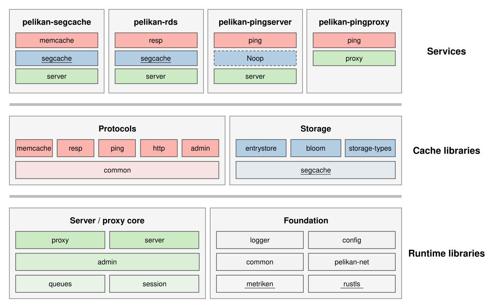
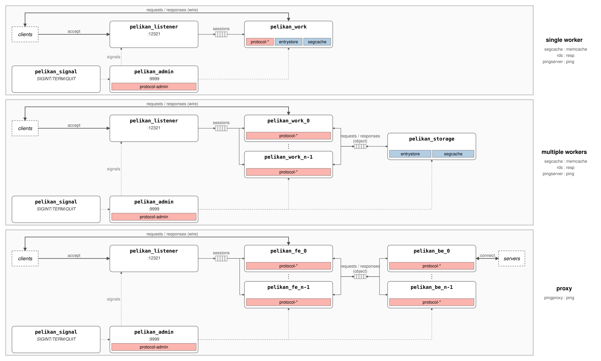
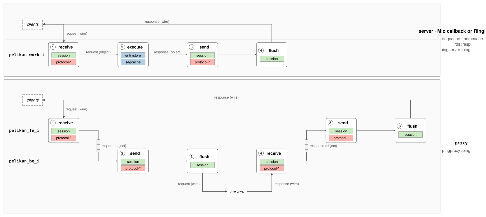

# Pelikan Architecture

Pelikan is a Cargo workspace that builds several cache services out of shared
libraries. This document explains the architecture in three views, each with a
generated chart:

1. [**What the code is**](#the-big-picture) — the layers, and how each shipped
   binary is composed from them.
2. [**What runs**](#how-a-service-runs) — the threads each binary spawns and
   the queues that connect them.
3. [**What happens to a request**](#life-of-a-request) — one request traced
   through those threads, in the code's own verbs.

The charts are generated from the build manifest and source assertions by
`cargo xtask diagrams` and are wider than this page — click any chart to open
it at full size (scroll/zoom in the browser). See
[Keeping this document honest](#keeping-this-document-honest) for how they
stay in sync with the code.

## The Big Picture

Read it bottom-up: **Runtime libraries** (the server/proxy cores and the
foundation utilities) support **Cache libraries** (wire protocols and storage),
and every **Service** at the top is a thin box composed of one bar from each
column below it — its protocol, its storage engine, its runtime core. External
crates (underlined, linked) are placed by their role in the stack, not their
repository of origin: the Segcache engine sits with storage, `rustls` and
`metriken` sit in the foundation.

That composition is the whole trick. Every product directly depends on the
foundation crates (`common`, `config`, `logger`); what distinguishes them is
three choices:

| Product | Protocol spoken | Core | Storage |
| --- | --- | --- | --- |
| `pelikan-segcache` | `protocol-memcache` | `server` | `entrystore::Seg` (Segcache engine) |
| `pelikan-rds` | `protocol-resp` | `server` | `entrystore::Seg` (Segcache engine) |
| `pelikan-pingserver` | `protocol-ping` | `server` | `entrystore::Noop` (no storage) |
| `pelikan-pingproxy` | `protocol-ping` (client + server) | `proxy` | none (`entrystore` linked only for trait bounds) |

Note that `pelikan-segcache` and `pelikan-rds` differ purely in wire
protocol — both run the Segcache engine. The no-op engine (dashed in the
chart) exists because ping needs no storage, and the proxy stores nothing at
all: requests pass through to upstream servers.

A new cache service is a new row in this table: pick a protocol, an engine,
and a core, and write the thin crate that wires them together.
`pelikan-pingserver` is the minimal worked example.

## How a Service Runs

Three panels, one per thread model. Thread names are the literal names the
code registers — what you see in `top -H` is what the chart says:

- **Single worker**: `pelikan_listener` accepts connections and hands
  sessions over a queue to one `pelikan_work` thread that parses, executes
  against thread-local storage, and responds.
- **Multiple workers**: parsing moves to `pelikan_work_0..n-1`; storage
  execution is centralized in a dedicated `pelikan_storage` thread. The
  difference from the single-worker model reads as the storage modules
  migrating out of the worker box.
- **Proxy**: frontend threads (`pelikan_fe_i`) face clients, backend threads
  (`pelikan_be_i`) face upstream servers, connected by object queues.

Servers pick between the first two models at runtime: the `[worker] threads`
config option spawns the single-worker model at `1` (the default) and the
multi-worker model — workers plus the dedicated storage thread — above it.

Two conventions carry the meaning: heavier edges are bytes crossing the
process boundary (the wire); thin edges are internal queues — accepted
sessions from the listener, parsed request/response objects everywhere
else. The control plane is the same everywhere — `pelikan_signal` relays
SIGINT/SIGTERM/SIGQUIT to `pelikan_admin` (port 9999), which broadcasts
shutdown to every sibling thread; a per-panel margin table expands which
binaries and protocols each panel covers.

## Life of a Request

One request, traced as numbered stages on thread swimlanes, named by the
code's own verbs: `receive` (read + parse), `execute`, `send` (compose),
`flush`. The stage pitch is uniform across panels, so the panels compare
column by column and the differences that remain are the real ones:

- In the **single worker** model all four stages run on one thread.
- In the **multiple workers** model stage ② dips into `pelikan_storage` —
  two queue crossings buy centralized storage.
- In the **proxy**, the request leaves through a backend thread to the
  upstream *servers* and the response retraces the path — six stages, with
  one queue crossing outbound (frontend → backend) and one on the return.

The control plane is intentionally out of scope here; the threading chart
carries it.

## Layer by Layer

**Runtime foundation** (`src/`)
- `common/` — shared types and traits across servers
- `config/` — TOML-based configuration parsing
- `logger/` — centralized logging with tracing
- `net/` — networking abstractions, event loops, TLS support
- `queues/` — inter-thread communication via queues and wakers
- `session/` — session management, buffered socket I/O

**Protocols** (`src/protocol/`)
- `admin/` — admin ASCII protocol for stats and management
- `memcache/` — Memcache ASCII protocol
- `resp/` — Redis RESP protocol with sorted set support
- `ping/` — minimal ping/pong protocol
- `http/` — HTTP protocol parser (not yet wired into any product; the admin
  HTTP endpoint on port 9998 is served by `core/admin` via `tiny_http`, not
  this crate)
- `common/` — shared protocol traits

**Storage** (`src/storage/`, `src/entrystore/`)
- `entrystore/` — the storage facade products program against; wraps the
  external `segcache` crate (segment-based engine from the `cache-rs`
  repository, [NSDI'21 paper](https://www.usenix.org/conference/nsdi21/presentation/yang-juncheng))
- `storage/types/` — shared storage type definitions
- `storage/bloom/` — bloom filter implementation (currently unused by any
  product)

**Server cores** (`src/core/`)
- `admin/` — the admin thread every binary runs
- `server/` — listener/worker/storage event loops, thread management, signal
  handling
- `proxy/` — frontend/backend event loops for proxies

**Products** (`src/server/`, `src/proxy/`)
- `server/segcache/`, `server/rds/`, `server/pingserver/` — the three servers
- `proxy/ping/` — the ping proxy

## Design Principles

- **Workers never block.** Threads communicate over lockless queues; the data
  plane holds no locks that a slow peer can convert into tail latency.
- **Control and data plane separation.** Management traffic (stats, version,
  shutdown) rides its own thread and port (9999 by default), so an operator
  inspecting a saturated server is not competing with cache traffic.
- **Per-module config and metrics.** Every module owns its configuration
  block and its metrics, and a product composes exactly the ones it uses.
- **Pluggable composition.** Protocols and storage engines are crates behind
  traits; adding one extends every product that wants it (see
  [The Big Picture](#the-big-picture)).

## Keeping This Document Honest

The three charts are generated — never hand-edited — by `cargo xtask
diagrams`:

- the build chart derives from `cargo metadata`, plus source greps for the
  wiring a manifest cannot see (which storage engine each product
  instantiates), and aborts on any unclassified crate;
- the runtime charts are anchored by source assertions (thread spawn sites,
  queue wiring, signal sets, ports, event-loop verbs — and absence
  assertions when a chart relies on something not existing) that abort
  generation when the code drifts.

CI regenerates all charts on every PR and fails on any diff against the
committed SVGs, so a refactor that changes the dependency structure or the
thread model fails the build instead of quietly invalidating a picture.
Regenerate after changing crate dependencies or thread/request-path code.
